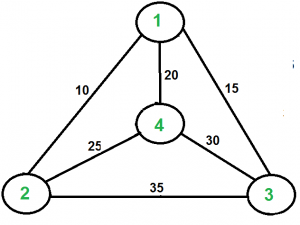
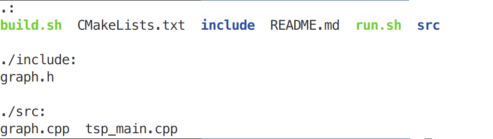
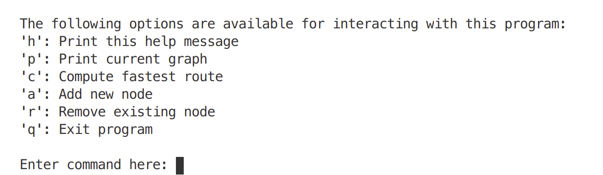
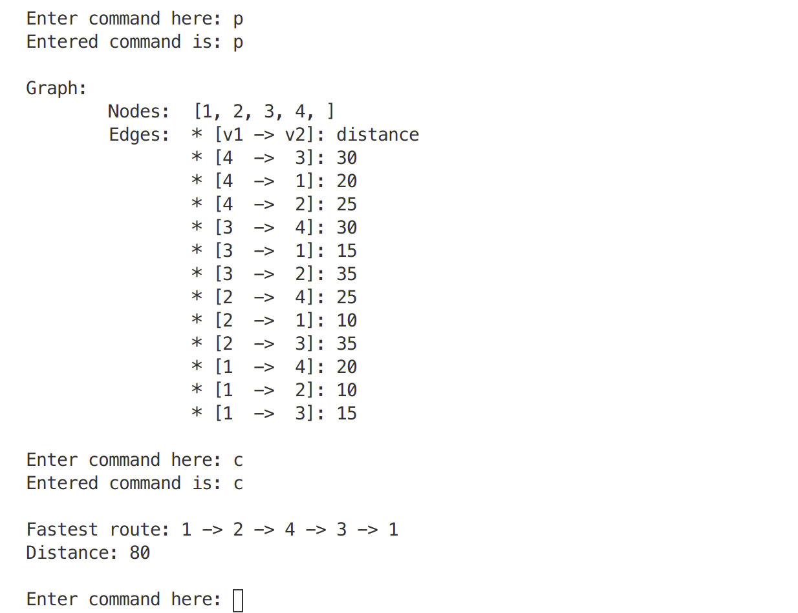
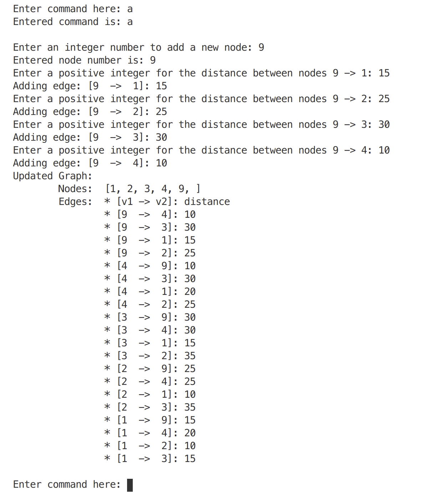
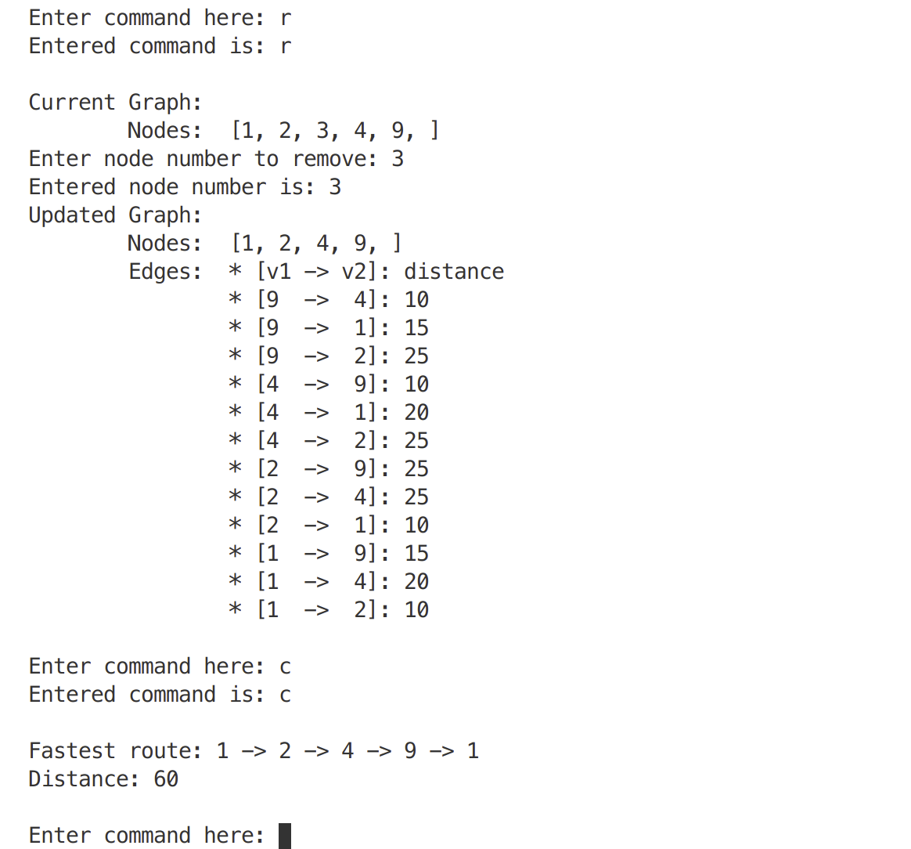
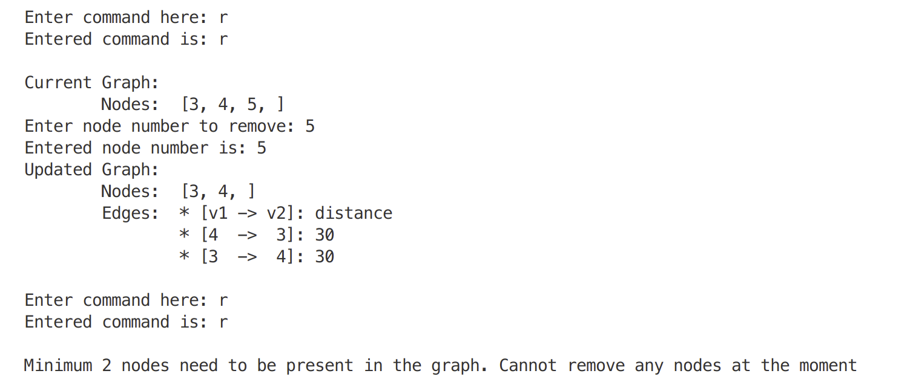

# Traveling Salesman Problem

The description of the problem and its use case is well described on this [Wiki page](https://en.wikipedia.org/wiki/Travelling_salesman_problem).

This application provides an interface to start with an example complete graph (shown below), computes the minimum hamiltonian route cost of the given complete graph and add/remove nodes from the graph and recompute the route cost.

To use the application, unpack the provided zip file and build and run using the instructions below.

## Dependencies

The application has dependencies that will be available with out of the box Ubuntu 20.04 operating system. They are as follows,

* *Operating system*: Ubuntu 20.04 or equivalent
* *CMake* 3.8.10 or above
* *gcc/g++* 7.5.0 or above 

## Build

The application builds using **CMake** (minimum required version is **3.8.10**). The folder structure of the application is,

Within the root directory of the application, the source files are in *./src* directory and the included headers are in *./include*. Two scripts *build.sh* and *run.sh* are provided for building and running the application.

Open a terminal window and follow the steps below,

* Make sure the scripts have execute permissions by running the command `ls -l`
* Run the provided build script using the command `./build.sh`

## Run

Open a new terminal window if not following from the "Build" section and execute the following commands from within the root directory of the application,

* Run the provided run script using the command `./run.sh`

The application should start up and the interactive shell console will show on your terminal window as shown below,

To proceed, enter one of the available commands. FOr example, to print the pre-loaded graph and compute the fastest route enter the command `p` followed by `c` as shown below,

*Note: The edges shown in the graph display are redundant because of the bi-directional nature of the edges in the graph.*

You can add/remove nodes from the graph using the commands `a` and `r`. A demonstration of the add command is shown below,

Node with ID 9 is added to the graph with the required edge weights. To recompute the fastest route after updating the graph, use the command `c`.

A demonstration of the remove command is shown below,

Here Node with ID 3 is removed from the graph and the fastest route is recomputed using the command `c`. Note that there needs to be a minimum of 2 nodes in the graph at any point and the application will not allow the user to do the same.

To exit the application, enter `q` at the command prompt and the application will exit cleanly.